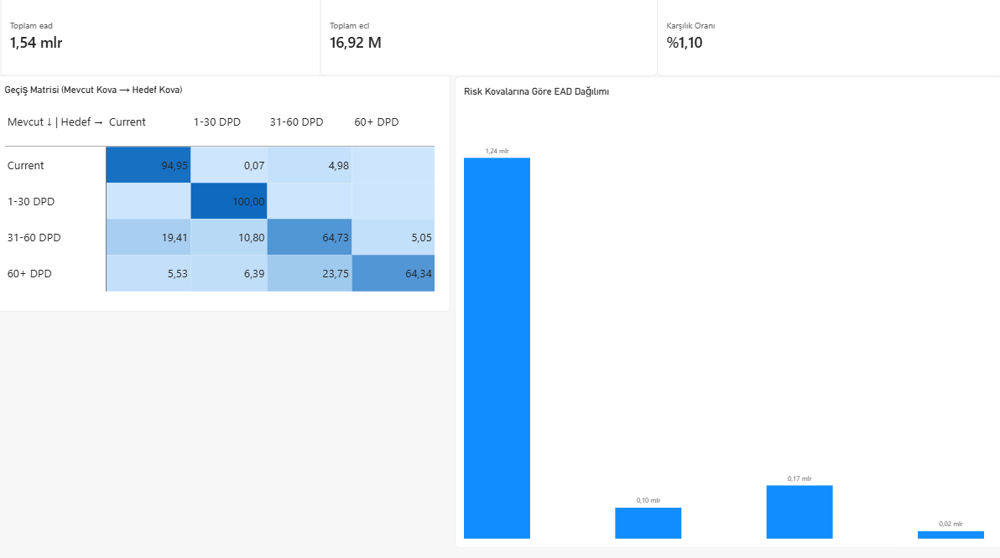

# IFRS 9 Credit Risk & Roll-Rate Transition Matrix Dashboard

An end-to-end Business Intelligence solution designed to analyze credit portfolio transition dynamics, expected credit loss (ECL) metrics, and risk concentration across delinquency buckets under the IFRS 9 framework.

## Scope and Risk Modeling

- **Roll-Rate Transition Matrix:** Modeled period-over-period state transitions across delinquency buckets (`Current`, `1-30 DPD`, `31-60 DPD`, `60+ DPD`). Visualized persistence along the diagonal and migration into default using conditional formatting.
- **Key Portfolio Indicators:**
  - **Exposure at Default (EAD):** 1.54B TL (Total portfolio exposure)
  - **Expected Credit Loss (ECL):** 16.92M TL (Total impairment allowance)
  - **Coverage Ratio:** 1.10% (Portfolio risk buffer level)
- **Bucket Distribution:** Evaluated portfolio concentration and exposure distribution across delinquency stages.

## Architecture and Technical Implementation

- **Data Layer (PostgreSQL):** Schema design, bucket assignment logic, and transition probability calculations.
- **Reporting & Business Intelligence (Power BI):**
  - Star schema / dimensional modeling utilizing decoupled dimension tables (`dim_risk_bucket`, `dim_next_bucket`) to support cross-bucket transition matrices.
  - Custom DAX measures for dynamic risk metrics (`EAD`, `ECL`, `Coverage Ratio`).
  - Executive-level dashboard formatting following institutional risk reporting standards.
